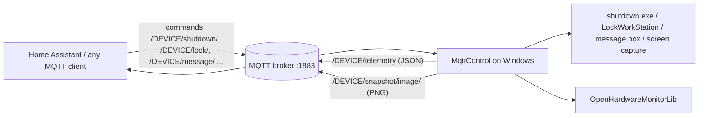

# MqttControl

A small C# (.NET Framework, WinForms) tray application that lets you control a Windows PC over
the MQTT protocol. It listens for commands such as shutdown, restart, lock, on-screen messages
and screenshots, and it periodically publishes system telemetry (CPU load and temperature,
memory, and drive usage) as JSON. The on-screen texts and icons are built around
[Home Assistant](https://www.home-assistant.io/), but any MQTT client can drive it.

## Table of contents

- [Features](#features)
- [How it works](#how-it-works)
- [Requirements](#requirements)
- [Installation](#installation)
- [Configuration](#configuration)
- [Usage](#usage)
- [MQTT topic reference](#mqtt-topic-reference)
- [Telemetry payload](#telemetry-payload)
- [Home Assistant integration](#home-assistant-integration)
- [Troubleshooting](#troubleshooting)
- [Known issues and limitations](#known-issues-and-limitations)
- [Security](#security)
- [Development](#development)
- [Contributing](#contributing)
- [License](#license)

## Features

- **Remote power control**: shut down or restart the PC through `shutdown.exe`, with the MQTT
  payload passed through as extra arguments (for example a delay such as `-t 30`).
- **Remote lock**: locks the workstation (`rundll32.exe user32.dll,LockWorkStation`).
- **On-screen messages**: shows a tray balloon tip and a custom message box
  ("Message From Home Assistant") that closes on its own after 30 seconds.
- **Screenshots**: captures the screen as a PNG and publishes the raw image bytes over MQTT, on
  request or automatically on every telemetry cycle.
- **Telemetry**: publishes CPU temperature, CPU load, used and free memory
  (via [OpenHardwareMonitor](https://openhardwaremonitor.org/)), and optionally per-drive
  size, free and used space, as JSON on a fixed interval.
- **Tray application**: runs hidden, with a tray icon and a context menu to exit or toggle
  "run at startup".
- **Single instance**: a named mutex prevents a second copy from starting.
- **Debug output**: can write the last published telemetry to `debug.json`.

## How it works



In the diagram, `DEVICE` stands for the value of the `devicename` setting.

1. On startup the app reads its settings from `MqttControl.exe.config`, connects to the broker
   with a random GUID as the client ID, and subscribes to its command topics.
2. It immediately publishes one telemetry message and one screenshot (a "heartbeat").
3. A timer then publishes telemetry every `updateinterval` seconds, plus a screenshot when
   `autoSnapshot` is `true`.
4. When the connection closes, the app tries to reconnect once right away. It also tries to
   reconnect before each publish when it is not connected.

## Requirements

- Windows with the **.NET Framework 4.5.1** or later
  (`TargetFrameworkVersion` `v4.5.1` in `MqttControl.csproj`).
- **Administrator rights.** `app.manifest` sets `requestedExecutionLevel` to
  `requireAdministrator`, so Windows shows a UAC prompt on every start. OpenHardwareMonitor
  needs these rights to read hardware sensors.
- An MQTT broker (for example Mosquitto or the Home Assistant Mosquitto add-on) reachable on
  **TCP port 1883**. The port is not configurable and TLS is not supported (see
  [Known issues](#known-issues-and-limitations)).
- To build: Visual Studio 2015 or later (the solution was created with Visual Studio 14), or
  MSBuild with the .NET Framework 4.5.1 targeting pack.

NuGet dependencies (committed under `packages/`):

| Package | Version | Used for |
|---|---|---|
| `M2Mqtt` | 4.3.0.0 | MQTT client |
| `OpenHardwareMonitor` (`OpenHardwareMonitorLib`) | 0.7.1 | CPU and memory sensors |
| `Newtonsoft.Json` | 11.0.2 (project reference); `packages.config` lists 13.0.1 | Telemetry JSON |
| `AudioSwitcher.AudioApi` / `.CoreAudio` | 3.0.0 / 3.0.0.1 | Volume and mute helpers (not wired to MQTT yet) |

## Installation

There are no published GitHub releases, so you build the app yourself.

### Build with Visual Studio

1. Clone the repository:
   ```bash
   git clone https://github.com/t0mer/MqttControl.git
   ```
2. Open `MqttControl.sln` in Visual Studio.
3. Select the **Release** configuration and build the solution (**Build → Build Solution**).
4. The output is in `MqttControl\bin\Release\`.

### Build with MSBuild

From a Developer Command Prompt:

```bat
msbuild MqttControl.sln /p:Configuration=Release
```

The NuGet packages are committed in `packages/`, so no restore is needed for the referenced
versions.

### Deploy

Copy the whole output folder (`MqttControl.exe`, `MqttControl.exe.config` and the DLLs) to a
folder on the target PC, edit `MqttControl.exe.config` (see [Configuration](#configuration)),
then start `MqttControl.exe` and accept the UAC prompt.

> The repository also contains a committed debug build in `MqttControl/bin/Debug/`. It is an
> unsigned build artifact, not a release. Prefer building from source; if you use it, review it
> first and run it only on machines you trust.

## Configuration

All settings are `appSettings` in `app.config`, which the build copies to
`MqttControl.exe.config` next to the executable. There is no settings window: edit the file
and restart the app. `Properties/Settings.settings` is empty and is not used.

| Key | Default in `app.config` | Description |
|---|---|---|
| `mqttserver` | *(empty, required)* | Broker host name or IP address. The port is always 1883. |
| `mqttuser` | *(empty)* | Broker username. |
| `mqttpass` | *(empty)* | Broker password. |
| `devicename` | *(empty, required)* | Name of this PC, used as the first segment of every topic (`/<devicename>/...`). |
| `updateinterval` | `60` | Telemetry interval in **seconds**. |
| `autoSnapshot` | `false` | `true` publishes a screenshot on every telemetry cycle. When `false`, a screenshot is taken only at startup and on request. |
| `publishDriveInfo` | `true` | Include per-drive information in the telemetry payload. |
| `debugMode` | `false` | `true` writes each telemetry payload to `debug.json` in the application folder. |

Other connection details are fixed in the code:

| Setting | Value |
|---|---|
| Port | 1883 (M2Mqtt default) |
| TLS | Not supported |
| Client ID | A new random GUID on every connect |
| Last Will / availability topic | None |
| Screenshot file | `<app folder>\Temp\Screenshot.png` (overwritten each time) |

Example `MqttControl.exe.config`:

```xml
<appSettings>
  <add key="mqttserver" value="192.168.1.10"/>
  <add key="mqttuser" value="your-mqtt-user"/>
  <add key="mqttpass" value="your-mqtt-password"/>
  <add key="devicename" value="office-pc"/>
  <add key="updateinterval" value="60"/>
  <add key="autoSnapshot" value="false"/>
  <add key="publishDriveInfo" value="true"/>
  <add key="debugMode" value="false"/>
</appSettings>
```

## Usage

MqttControl has no visible window. After it starts, it shows the **Mqtt Control** icon in the
notification area. Right-click the icon for these options:

| Menu item | What it does |
|---|---|
| **Exit MqttControl** | Disconnects from the broker and exits. |
| **Run MqttControl at startup** | Adds a `MQTTControl` value under `HKCU\SOFTWARE\Microsoft\Windows\CurrentVersion\Run` that points to the executable. |
| **Disable running MqttControl at startup** | Removes that registry value. |

Only one instance can run at a time. Starting it again while it is running does nothing.

Example commands with the Mosquitto clients (device name `office-pc`):

```bash
# Shut down in 60 seconds
mosquitto_pub -h 192.168.1.10 -u user -P pass -t "/office-pc/shutdown/" -m "-t 60"

# Restart now
mosquitto_pub -h 192.168.1.10 -u user -P pass -t "/office-pc/restart/" -m "-t 0"

# Lock the workstation (payload is ignored)
mosquitto_pub -h 192.168.1.10 -u user -P pass -t "/office-pc/lock/" -m "lock"

# Show a message on screen
mosquitto_pub -h 192.168.1.10 -u user -P pass -t "/office-pc/message/" -m "Dinner is ready"

# Request a screenshot and save it. The image is not retained, so start the
# subscriber first; -N stops mosquitto_sub from appending a newline to the PNG.
mosquitto_sub -h 192.168.1.10 -u user -P pass -t "/office-pc/snapshot/image/" -C 1 -N > screenshot.png &
mosquitto_pub -h 192.168.1.10 -u user -P pass -t "/office-pc/snapshot/" -m "1"
wait

# Watch telemetry
mosquitto_sub -h 192.168.1.10 -u user -P pass -t "/office-pc/telemetry" -v
```

## MQTT topic reference

`<device>` is the `devicename` setting. Note that all topics **start with a slash** and every
command topic **ends with a slash**. Only the published `/<device>/telemetry` topic has no
trailing slash. Topics must match exactly.

### Command topics (subscribed)

| Topic | Subscribe QoS | Payload | Action |
|---|---|---|---|
| `/<device>/shutdown/` | 2 | Extra `shutdown.exe` arguments, e.g. `-t 60` (may be empty) | Runs `shutdown.exe -s <payload>`. Without `-t`, Windows uses its default delay. |
| `/<device>/restart/` | 1 | Extra `shutdown.exe` arguments, e.g. `-t 0` (may be empty) | Runs `shutdown.exe -r <payload>`. |
| `/<device>/lock/` | 2 | Ignored | Locks the workstation via `rundll32.exe user32.dll,LockWorkStation`. |
| `/<device>/message/` | 2 | Message text | Shows a tray balloon titled "Home Assistant" and a message box titled "Message From Home Assistant" that auto-closes after 30 seconds. |
| `/<device>/execute/` | 1 | Text | **Does not execute anything.** It currently shows the payload as a message, exactly like `/message/`. |
| `/<device>/snapshot/` | via `#` | Ignored | Takes a screenshot and publishes it to `/<device>/snapshot/image/`. |
| `/<device>/logoff/` | 2 | Ignored | **No-op**: the log-off call is commented out in the code. |
| `/<device>/cancel/` | via `#` | Ignored | **No-op**: the "abort shutdown" call is commented out. |
| `/<device>/test/` | 1 | Ignored | Subscribed, but has no handler. |

The app also subscribes to the wildcard `#` (QoS 1). This is why `/snapshot/` and `/cancel/`
work without their own subscription, but it also means the app receives **every message on the
broker** that its user is allowed to read, including its own telemetry and snapshot PNGs.

The payload is decoded with the system's default ANSI code page (`Encoding.Default`).

### State and telemetry topics (published)

| Topic | QoS | Retain | Payload | When |
|---|---|---|---|---|
| `/<device>/telemetry` (no trailing slash) | 2 | No | JSON, see [Telemetry payload](#telemetry-payload) | At startup, then every `updateinterval` seconds |
| `/<device>/snapshot/image/` | 2 | No | Raw PNG bytes (1920×1080) | At startup, on a `/snapshot/` request, and every interval when `autoSnapshot` is `true` |

No availability, Last Will or Home Assistant discovery messages are published.

## Telemetry payload

The whole JSON string, keys **and values**, is converted to lowercase before publishing.
Example with `publishDriveInfo=true`:

```json
{
  "cputemp": "54",
  "cpuusage": "7.8125",
  "usedmemory": "6.21",
  "freememory": "9.73",
  "drives": [
    {
      "name": "c:\\",
      "volumelabel": "",
      "drivetype": "fixed",
      "totalsize": "476 gb",
      "freespace": "201 gb",
      "usedspace": "275 gb",
      "filesystem": "ntfs"
    }
  ]
}
```

| Field | Source | Notes |
|---|---|---|
| `cputemp` | OpenHardwareMonitor sensor "CPU Package" (°C) | `null` when the CPU has no sensor with that name. <!-- TODO: verify which AMD CPUs report "CPU Package" with OpenHardwareMonitorLib 0.7.1 --> |
| `cpuusage` | OpenHardwareMonitor sensor "CPU Total" (%) | |
| `usedmemory` | OpenHardwareMonitor sensor "Used Memory" (GB) | |
| `freememory` | OpenHardwareMonitor sensor "Available Memory" (GB) | |
| `drives` | `System.IO.DriveInfo` | Ready drives only, CD-ROM drives skipped; empty list when `publishDriveInfo` is `false`. Sizes are formatted strings from the Windows `StrFormatByteSize` API, e.g. `476 gb`. |

All numeric values are sent as strings. The example values above are illustrative.

Numeric values are formatted with the PC's current culture (`ToString()` without an invariant
culture). On locales that use a comma as the decimal separator, values look like `"7,8125"`,
and the Home Assistant `| float(0)` templates below then return `0`.

## Home Assistant integration

MqttControl does **not** publish MQTT discovery messages, so you configure the entities
manually in `configuration.yaml`. The examples below use the device name `office-pc`.

```yaml
mqtt:
  sensor:
    - name: "Office PC CPU usage"
      state_topic: "/office-pc/telemetry"
      value_template: "{{ value_json.cpuusage | float(0) | round(1) }}"
      unit_of_measurement: "%"
    - name: "Office PC CPU temperature"
      state_topic: "/office-pc/telemetry"
      value_template: "{{ value_json.cputemp }}"
      unit_of_measurement: "°C"
      device_class: temperature
    - name: "Office PC used memory"
      state_topic: "/office-pc/telemetry"
      value_template: "{{ value_json.usedmemory | float(0) | round(2) }}"
      unit_of_measurement: "GB"
    - name: "Office PC free memory"
      state_topic: "/office-pc/telemetry"
      value_template: "{{ value_json.freememory | float(0) | round(2) }}"
      unit_of_measurement: "GB"

  button:
    - name: "Office PC shutdown"
      command_topic: "/office-pc/shutdown/"
      payload_press: "-t 30"
    - name: "Office PC restart"
      command_topic: "/office-pc/restart/"
      payload_press: "-t 30"
    - name: "Office PC lock"
      command_topic: "/office-pc/lock/"
      payload_press: "lock"
    - name: "Office PC take screenshot"
      command_topic: "/office-pc/snapshot/"
      payload_press: "1"

  camera:
    - name: "Office PC screen"
      topic: "/office-pc/snapshot/image/"
```

Send a message to the PC from an automation or script:

```yaml
action: mqtt.publish
data:
  topic: "/office-pc/message/"
  payload: "The washing machine is done"
```

Because telemetry is not retained, the sensors show `unknown` after a Home Assistant restart
until the next telemetry cycle.

## Troubleshooting

- **The app crashes at startup.** `mqttserver` must be set and resolvable. The MQTT client is
  created in a `Form1` field initializer, so an empty or unresolvable host name throws an
  exception that is not caught, and the app crashes.
- **The app runs but nothing is published.** If the host resolves but the broker cannot be
  reached, the connection error is swallowed and the app keeps running, trying to reconnect
  before each publish.
  <!-- TODO: verify whether a publish without a connection throws in M2Mqtt 4.3 (and so shows an error or crashes) -->
- **Nothing happens on a command.** Check the exact topic, including the leading and trailing
  slashes, and that `devicename` matches. Telemetry is the only topic without a trailing slash.
- **`cputemp` is `null`.** Your CPU does not expose a "CPU Package" temperature sensor through
  OpenHardwareMonitorLib 0.7.1, or the app is not running elevated.
- **Shutdown takes 30 seconds.** Without a `-t` value in the payload, `shutdown.exe` uses its
  default timeout. Send `-t 0` for an immediate shutdown.
- **Home Assistant sensors show `0`.** On a Windows locale with a comma decimal separator the
  telemetry contains values like `"7,8125"`, which `float(0)` cannot parse. Replace the comma
  in the template, e.g. `{{ value_json.cpuusage | replace(',', '.') | float(0) }}`.
- **Messages with non-Latin characters are garbled.** Incoming payloads are decoded with the
  system ANSI code page, not UTF-8.
- **The screenshot is cropped or padded.** The capture size is fixed at 1920×1080 from the
  top-left corner of the primary screen.
- **Checking what is published.** Set `debugMode` to `true` and look at `debug.json` in the
  application folder.
- **Does not start at logon.** The startup entry is written to the per-user `Run` key, but the
  app requires administrator rights. Windows may not start elevated programs from that key.
  <!-- TODO: verify; a Task Scheduler task with "Run with highest privileges" is the usual workaround -->

## Known issues and limitations

- Suspend and hibernate topics (`/<device>/suspend/`, `/<device>/hibernate/`) are defined in
  `Topics.cs`, and `Power.cs` has matching helpers, but they are **not subscribed or handled**.
- Volume/mute (`Audio.cs`), text-to-speech (`TTS.cs`) and battery status (`Power.cs`) helpers
  exist but are **not connected to any MQTT topic**.
- `/logoff/` and `/cancel/` are no-ops, `/execute/` only shows a message, and `/test/` has no
  handler.
- The broker port (1883) and plain TCP are hard-coded; there is no TLS support.
- The app subscribes to `#`, so it receives all broker traffic its user can read.
- The client ID is a new GUID on every connection, and there is no Last Will or availability
  topic, so subscribers cannot tell whether the PC is online.
- Reconnection is a single immediate attempt, with no retry loop or back-off.
- Screenshots are always 1920×1080 and only cover the primary screen.
- `packages.config` lists Newtonsoft.Json 13.0.1, while the project still references
  11.0.2 from `packages/`.
- The message box is shown as a modal dialog inside the MQTT receive handler. While it is open
  (up to about 30 seconds), other commands, including shutdown, are not processed.
- Numeric telemetry values use the current culture's decimal separator (see
  [Telemetry payload](#telemetry-payload)).
- The hidden main form contains a leftover debug button (`button1`).

## Security

MqttControl can shut down, restart and lock the PC, show arbitrary text on screen, and send
screenshots of the desktop, all driven by MQTT messages. Anyone who can publish to its
command topics, or read its snapshot topic, has that power. Keep this in mind:

- Use a broker with **authentication enabled** and give MqttControl its own user with an ACL
  that only allows its `/<device>/...` topics. This also limits what the `#` subscription can
  receive.
- The connection is **unencrypted** (plain MQTT on port 1883), so credentials, commands and
  screenshots travel in clear text. Use it only on a trusted local network, or through a VPN;
  never expose the broker directly to the internet.
- The app runs with **administrator rights**, and the shutdown/restart payload is passed to
  `shutdown.exe` as arguments.
- The broker password is stored in plain text in `MqttControl.exe.config`. Restrict access to
  the application folder.
- Screenshots may contain sensitive information and are also stored on disk in the `Temp`
  folder.

## Development

Project layout:

```
MqttControl.sln
MqttControl/
├── Program.cs             # Entry point, single-instance mutex
├── Form1.cs               # MQTT client, topic handlers, telemetry timer, tray menu, screenshots
├── Form1.Designer.cs      # Hidden form, tray icon and context menu
├── MyMessageBox.cs        # Auto-closing message box (30 s)
├── SysInfo.cs             # Collects sensor data (OpenHardwareMonitorLib) and drive info
├── Telemetry.cs / HDD.cs  # Telemetry JSON models
├── UpdateVisitor.cs       # OpenHardwareMonitor visitor that refreshes sensors
├── Utils.cs               # Byte-size formatting helpers
├── Topics.cs              # Topic templates (not used by Form1)
├── Power.cs               # Power/battery helpers (partly unused)
├── Audio.cs               # Volume/mute helpers (unused)
├── TTS.cs                 # Text-to-speech helper (unused)
├── app.config             # appSettings (copied to MqttControl.exe.config)
├── app.manifest           # requireAdministrator
└── packages.config
packages/                  # Committed NuGet packages
```

Notes:

- The Debug configuration targets **x86**; the Release configuration targets **AnyCPU**.
- The `bin/` and `obj/` build outputs are currently tracked in git.
- There are no automated tests.

## Contributing

Issues and pull requests are welcome. Please keep changes focused, describe how you tested
them on Windows, and update this README when you add or change MQTT topics or settings.

## License

This repository does not include a license file, so no license is granted by default.
<!-- TODO: verify: add a LICENSE file if the project should be open source -->
